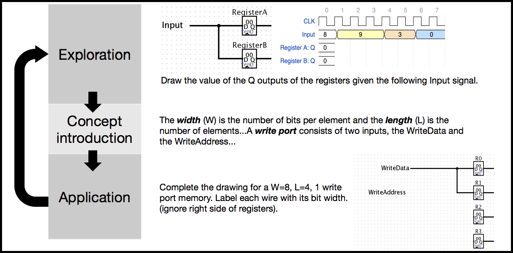

# The project

Surveys of computer science and engineering instructors have indicated that two of the common reasons they do not adopt research-based instruction strategies are preparation time and lack of materials. This lack of materials to support research-based instruction was evident in Computer Architecture & Organization (AR). We are creating, piloting, revising, and sharing activities inspired by Process Oriented Guided Inquiry Learning (POGIL). POGIL is a research-based instruction strategy that comprises self-managed teams, development of process skills, and activities designed based on a theory of instruction called learning cycles.

# The activities

The activities on architecture (Memory Organization of Programs, Stored Programs, Procedure Calls) use MIPS, following textbooks like _Harris & Harris, Digital Design and Computer Architecture, 2nd Ed, 2012_ and _Patterson & Hennessey, Computer Organization and Design MIPS Edition, 5th Ed, 2014_. The activities on digital design could fit into any course on digital design or computer organization.

[Download](https://iowa-my.sharepoint.com/:f:/g/personal/bdmyers_uiowa_edu/Eruf6jcdgYRHnHdkB4_84ioBAFi6fX7CMHCu5TVWLnCtBw?e=RybK85) the activities.

* Bits and numbers
* Memory organization of programs
* Stored programs
* Procedure calls
* Combinational logic
* Adders and delay
* Adders, shifters, multipliers
* Sequential logic
* Addressable memory and the add instruction
* Engineering digital systems

You can also find the activities on [cspogil.org](http://cspogil.org/AR.+Architecture+and+Organization).

To quickly determine whether an activity might fit into your course, take a look at the [learning objectives](docs/learning_objectives.pdf) for each activity.

## License

The activities are licensed with the following:

 Active Learning Activities for Computer Architecture and Organization by <a xmlns:cc="http://creativecommons.org/ns#" href="http://homepage.cs.uiowa.edu/~bdmyers/" property="cc:attributionName" rel="cc:attributionURL">Brandon Myers</a> is licensed under a <a rel="license" href="http://creativecommons.org/licenses/by/4.0/">Creative Commons Attribution 4.0 International License</a>. Permissions beyond the scope of this license may be available by <a xmlns:cc="http://creativecommons.org/ns#" href="mailto:brandon-d-myers@uiowa.edu" rel="cc:morePermissions">contacting the author</a>.

# Publications

* Myers, Brandon. _Active Learning Materials for Computer Architecture and Organization_, SIGCSE 2018 ([Abstract](https://dl.acm.org/citation.cfm?id=3159450.3162262), [Poster](http://homepage.cs.uiowa.edu/~bdmyers/papers/myers_pogil_sigcse2018.pdf))

# Acknowledgement

* Funding for this project was generously provided by an [ACM SIGCSE Special Projects Award](https://sigcse.org/sigcse/programs/special/awards). Read the [project final report](docs/SP-report-2017-myers.pdf).
* These activities are based on an instruction strategy called Process-oriented Guided Inquiry Learning (POGIL). The activities are not endorsed by the POGIL Project.

# More information

* Find more Computer Science POGIL activities at [CS-POGIL](http://cspogil.org/Home)
* [Learn about POGIL](https://pogil.org/)

